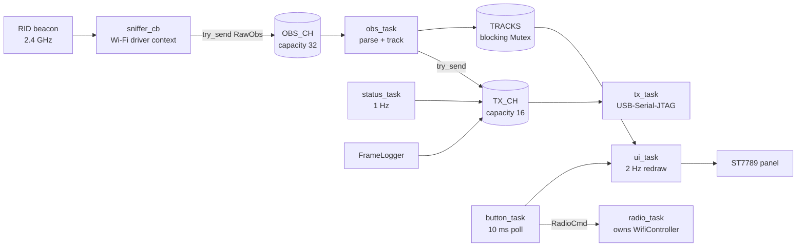

# RID Pocket Receiver — Technical Design & Agent Coding Plan

Sep 24, 2026 · @Andrew · v1.3 (changes in section 14)

## 0. Rules for the implementing agent

Build exactly what this document specifies. Where it is silent, choose the simplest option that satisfies it and record the choice in `DECISIONS.md` at the repo root.

**Normative words.** MUST, MUST NOT, SHOULD and MAY carry their RFC 2119 meanings. Text without one of those words is explanation, not requirement.

**Precedence when sources disagree**

1. Byte layouts (sections 5 and 9) and pin assignments (section 2) are fixed. Never change them to make code compile.
2. The real API of the exact crate versions in the committed `Cargo.lock` beats the code sketches here. Keep the specified behavior, adapt the call, and log the adaptation in `DECISIONS.md`.
3. Otherwise this document beats habit, blog posts and older examples found online.

**Hard constraints (MUST NOT)**

- Transmit anything: no raw 802.11 TX, no soft-AP, no scan, no connect, no BLE advertising or scanning. Receive-only is a project boundary.
- Add a dependency whose license fails the `cargo deny` gate in section 4.
- Run `cargo update`, or change a pinned version, outside milestone M0.
- Use `unsafe` outside `firmware/src/radio.rs`. `crates/odid`, `crates/rid-proto` and `tools/rid-host` MUST declare `#![forbid(unsafe_code)]`.
- Allocate, log, take a blocking lock, or `.await` inside the promiscuous callback.
- Use `alloc` in `crates/odid` or `crates/rid-proto`.

**Stop and ask a human when**

- a MUST cannot be met with the locked crate versions;
- the display stays dark after the section 2 bring-up sequence is followed exactly;
- any task appears to require transmitting, or a GPL, LGPL, AGPL or MPL dependency.

**Working rules**

- Work milestone by milestone (section 12). A milestone is done when every acceptance check passes; commit it as `M<n>: <title>`.
- `cargo fmt --check` and `cargo clippy -- -D warnings` MUST pass on every commit, for host crates and firmware.
- After initialization, firmware MUST NOT call `unwrap()` or `expect()`. Init-time failures MAY panic with a message naming the failed step.
- Units everywhere: metres, degrees, m/s, dBm. Device time is microseconds since boot, as `u64`.
- The lean-code rules in `CLAUDE.md` are binding.

## 1. Summary, goals, non-goals

The RID Pocket Receiver is receive-only firmware for a LILYGO T-Display-S3. It decodes ASTM F3411 Wi-Fi Beacon Remote ID, shows live tracks on the built-in screen, and streams raw observations over USB to a host.

| ID | v1 goal | Verified by |
| --- | --- | --- |
| G1 | Capture Wi-Fi Beacon RID on one 2.4 GHz channel (default 6), switchable at runtime | Channel shown on screen and in STATUS frames |
| G2 | Decode Basic ID, Location/Vector, Self-ID, System and Operator ID from Message Packs; count Authentication messages without decoding them | Unit tests on the section 11 vectors |
| G3 | Keep up to 16 tracks keyed by transmitter MAC; render them in landscape at no more than 2 Hz | Section 8 layout on hardware |
| G4 | Emit one OBS frame per RID beacon over USB-Serial-JTAG: raw 25-byte messages, RSSI, channel, timestamp | `rid-host` shows zero CRC errors over 10 minutes |
| G5 | Host tool converts the stream to JSON Lines | Section 10 schema |
| G6 | `odid` parser is `no_std`, fuzzed, and never panics | 10-minute `cargo fuzz` run with no crash |

**Non-goals for v1 (MUST NOT be built):** any transmission; Wi-Fi NAN; Bluetooth RID (the sensor head's nRF52840 covers it); 5 GHz (the ESP32-S3 radio is 2.4 GHz only); own position, range or bearing; Kafka publishing; OTA updates; settings persisted to flash; Authentication verification.

**Done means:** with a Remote ID broadcaster on the selected channel within about 100 m, its UAS ID appears on screen within 5 s and `rid-host` prints a matching JSON line.

## 2. Hardware reference: LILYGO T-Display-S3

The target is the T-Display-S3: ESP32-S3R8, 16 MB flash, 8 MB OPI PSRAM, and a 1.9-inch 170×320 ST7789V panel on an 8-bit Intel-8080 parallel bus. Touch and non-touch variants share every pin below.

### 2.1 Pin map (normative)

| Signal | GPIO | Firmware mode | Level and role |
| --- | --- | --- | --- |
| POWER\_ON | 15 | Output | Drive HIGH first. Powers the LCD and peripherals; required on battery |
| LCD\_BL | 38 | Output | HIGH after display init. mipidsi does not drive the backlight |
| LCD\_RST | 5 | Output | Start HIGH; hand to mipidsi `reset_pin` (active low) |
| LCD\_CS | 6 | Output | LOW permanently; the panel is the only bus device |
| LCD\_DC | 7 | Output | Start LOW; mipidsi `ParallelInterface` dc |
| LCD\_WR | 8 | Output | Start HIGH; mipidsi `ParallelInterface` wr |
| LCD\_RD | 9 | Output | HIGH permanently; firmware never reads the panel |
| LCD\_D0 … D7 | 39, 40, 41, 42, 45, 46, 47, 48 | Output | Start LOW; tuple order D0→D7 into `Generic8BitBus` |
| BUTTON\_A (BOOT) | 0 | Input, pull-up | Active low. Strapping pin; read only after boot |
| BUTTON\_B (KEY) | 14 | Input, pull-up | Active low |
| BAT\_ADC | 4 | Analog input (ADC1) | Battery voltage ÷ 2 through the on-board divider. Read only; added in v1.3 (section 8.8) |

The following MUST NOT be configured in v1: GPIO16/21 (touch), GPIO17/18 (I2C), GPIO43/44 (UART0), and GPIO19/20 (native USB).

### 2.2 Panel parameters (normative)

| Parameter | Value |
| --- | --- |
| Driver model | `mipidsi::models::ST7789` |
| Native size | `display_size(170, 320)` |
| Offset | `display_offset(35, 0)`: the 170 columns sit 35 columns into the 240-column controller RAM |
| Inversion | `invert_colors(ColorInversion::Inverted)` (IPS panel) |
| Color order | Default (RGB) |
| Orientation | `Orientation::new().rotate(Rotation::Deg90)` → logical 320 wide × 170 tall |
| Pixel format | Rgb565 |

**Physical reference orientation:** screen facing the viewer, USB-C port on the viewer's right. Text MUST read left-to-right in that pose. If it renders upside down, change `Deg90` to `Deg270` and log it in `DECISIONS.md`.

### 2.3 Bring-up sequence (normative order)

1. POWER\_ON (GPIO15) HIGH, then wait 10 ms; the panel needs a few milliseconds after power-on.
2. LCD\_RD HIGH, LCD\_CS LOW, LCD\_WR HIGH, LCD\_DC LOW, data pins LOW.
3. Build `Generic8BitBus` from D0–D7, then `ParallelInterface::new(bus, dc, wr)`.
4. `Builder::new(ST7789, di)` with the section 2.2 options, `.reset_pin(rst)`, `.init(&mut delay)`.
5. Clear to black.
6. LCD\_BL HIGH.

```rust
// Sketch only; exact esp-hal/mipidsi signatures follow the locked versions (section 0).
let pwr = Output::new(p.GPIO15, Level::High, OutputConfig::default());
embassy_time::Timer::after_millis(10).await;
let rd = Output::new(p.GPIO9, Level::High, OutputConfig::default());
let cs = Output::new(p.GPIO6, Level::Low, OutputConfig::default());
let dc = Output::new(p.GPIO7, Level::Low, OutputConfig::default());
let wr = Output::new(p.GPIO8, Level::High, OutputConfig::default());
let rst = Output::new(p.GPIO5, Level::High, OutputConfig::default());
let o = |pin| Output::new(pin, Level::Low, OutputConfig::default());
let bus = Generic8BitBus::new((
    o(p.GPIO39), o(p.GPIO40), o(p.GPIO41), o(p.GPIO42),
    o(p.GPIO45), o(p.GPIO46), o(p.GPIO47), o(p.GPIO48),
));
let di = ParallelInterface::new(bus, dc, wr);
let mut display = Builder::new(ST7789, di)
    .reset_pin(rst)
    .display_size(170, 320)
    .display_offset(35, 0)
    .invert_colors(ColorInversion::Inverted)
    .orientation(Orientation::new().rotate(Rotation::Deg90))
    .init(&mut Delay::new())
    .expect("display init");
display.clear(Rgb565::BLACK).ok();
let bl = Output::new(p.GPIO38, Level::High, OutputConfig::default());
// pwr, rd, cs, bl MUST live for the whole program: move them into a
// `PanelKeepAlive` struct owned by the UI task. Never drop them.
```

The closure `o` is illustrative; if the typed GPIO singletons prevent it, write the eight calls out.

**Why bit-banged GPIO and not the LCD\_CAM I8080 peripheral:** mipidsi's `Generic8BitBus` is fully specified by one crate and needs no adapter code. A full-screen redraw costs roughly 50–110 ms, which is acceptable at a 2 Hz UI. The DMA-driven I8080 driver in esp-hal is an allowed later optimization, not v1 scope.

### 2.4 USB, flashing, power

- The USB-C port is the ESP32-S3's native USB-Serial-JTAG. The host sees one CDC-ACM serial port (`/dev/ttyACM*` on Linux); flashing and data share it.
- Manual download mode, if auto-reset fails: hold BOOT, press and release RST, release BOOT, then flash.
- USB-C supplies 5 V. A 3.7–4.2 V LiPo on the JST 1.25 mm connector also works, but only with GPIO15 HIGH.
- The Wi-Fi antenna is on-board. An external antenna needs a resistor moved on the PCB; that is a hardware change outside this plan.
- This board is also used by the weather display and the sensor-head status screen. Flashing this firmware replaces whatever is on it.

Sources: [LilyGO T-Display-S3 README](https://github.com/Xinyuan-LilyGO/T-Display-S3) (pins, memory, GPIO15, download mode, antenna); [HomeDing T-Display-S3 board page](https://homeding.github.io/boards/esp32s3/lilygo-t-display-s3.htm) (column offset 35, IPS inversion, 8-bit bus pins).

## 3. Architecture

One embassy executor runs six tasks. The Wi-Fi promiscuous callback is the only producer outside the executor, and it only filters, copies and enqueues.



Raw frames flow left to right; every queue drops the newest item when full and counts the drop.

### 3.1 Tasks and ownership

| Unit | Owns | Consumes | Produces | Trigger |
| --- | --- | --- | --- | --- |
| `sniffer_cb` (plain `fn`, not a task) | Nothing | `PromiscuousPkt` | `OBS_CH.try_send`, counters | Every received frame |
| `obs_task` | Nothing | `OBS_CH` | `TRACKS` update, OBS frame to `TX_CH` | Each `RawObs` |
| `tx_task` | `UsbSerialJtag` (async) | `TX_CH` | Bytes on USB | Each queued frame |
| `status_task` | Nothing | Counters | STATUS frame to `TX_CH`; HELLO every 30th pass | Every 1000 ms |
| `radio_task` | `WifiController`, `Sniffer` | `RADIO_CMD` | `set_channel` calls | Command, or hop timer |
| `button_task` | Two `Input` pins | Pin levels | `UI_EVT`, `RADIO_CMD` | Every 10 ms |
| `ui_task` | Display, `PanelKeepAlive` | `TRACKS` snapshot, `UI_EVT` | Pixels | Every 500 ms, or on an event |

### 3.2 Concurrency rules (normative)

- `sniffer_cb` MAY: read the packet, run the section 6.3 filter, copy at most 240 bytes into a stack `RawObs`, call `OBS_CH.try_send`, and increment atomics.
- A critical section (embassy-sync `CriticalSectionRawMutex`) is allowed in the callback. Anything that can wait, allocate or log is not.
- Every producer uses `try_send`. On `Full`, drop the item and increment its drop counter. Nothing ever blocks a producer.
- Every wire frame is sequenced and queued under `TX_LOCK` (section 9.2). `FrameLogger` can run on esp-radio's preemptive driver thread, so a bare `seq` atomic would let frames reach `TX_CH` out of order.
- `TRACKS` is `embassy_sync::blocking_mutex::Mutex<CriticalSectionRawMutex, RefCell<TrackTable>>`. Hold it only to update one track or to copy a snapshot of at most 8 rows.
- `ui_task` MUST yield (`embassy_futures::yield_now().await`) after drawing each text row, so no single draw blocks the executor for more than about 12 ms.
- Counters are `core::sync::atomic::AtomicU32` statics using `Ordering::Relaxed`. The ESP32-S3 has native 32-bit atomics.
- If no host reads the USB port, `tx_task` stalls, `TX_CH` fills, and frames are dropped and counted. Capture and display continue unaffected.

### 3.3 Time base

- `t_dev_us` = `esp_hal::time::Instant::now()` as microseconds since boot (`u64`), read inside `sniffer_cb`. It is the only timestamp used for ordering and track ageing.
- `t_mac_us` = the Wi-Fi driver's `rx_cntl.timestamp`, truncated to `u32`. Its epoch may differ from `t_dev_us`, so it is informational only.
- The device has no wall clock. The host stamps UTC on receipt (section 10).

### 3.4 Boot order (normative)

1. `esp_hal::init` with `CpuClock::max()` (240 MHz).
2. Heap: `esp_alloc` in two regions, 64 KiB of reclaimed bootloader RAM plus 36 KiB, as the esp-radio 0.18 docs show.
3. `esp_rtos::start(timg0.timer0, software_interrupt0)`.
4. Panel bring-up (section 2.3); draw the text `BOOT`.
5. `esp_radio::wifi::new(peripherals.WIFI, ControllerConfig::default())`. This starts the controller in station mode, unconnected.
6. `sniffer.set_receive_cb(sniffer_cb)`, then `sniffer.set_promiscuous_mode(true)`.
7. `controller.set_channel(6, SecondaryChannel::None)`.
8. Spawn `tx_task`, `obs_task`, `status_task`, `radio_task`, `button_task`, `ui_task`.
9. Queue one HELLO frame.

The `WifiController` MUST live for the program's lifetime: dropping it deinitializes Wi-Fi. `radio_task` owns it and never returns.

### 3.5 Memory budget

| Item | Size | Placement |
| --- | --- | --- |
| `esp_alloc` heap | 100 KiB (64 KiB reclaimed + 36 KiB) | Internal SRAM; esp-radio station mode measured 47–57 KiB |
| `OBS_CH` | 32 × `RawObs` (≤ 256 B) ≈ 8 KiB | `static` |
| `TX_CH` | 16 × `FrameBuf` (320 B) = 5 KiB | `static` |
| `TRACKS` | 16 × `Track` (≈ 200 B) ≈ 3.2 KiB | `static` |
| PSRAM | Not used in v1 | The esp-hal `psram` feature MUST stay off |

The 47–57 KiB figure comes from the [esp-radio 0.18.0 Wi-Fi module docs](https://docs.rs/crate/esp-radio/latest/source/src/wifi/mod.rs).

## 4. Toolchain, repository layout, dependencies

The repo holds two Cargo workspaces: host crates on stable Rust, and the firmware package on the Xtensa `esp` toolchain. The shared crates `odid` and `rid-proto` are plain `no_std` libraries that both sides compile.

### 4.1 Toolchains (run once)

```bash
rustup toolchain install stable nightly
cargo install espup --locked
espup install --targets esp32s3   # installs the Xtensa Rust fork as toolchain "esp"
# espup prints an export script path (normally $HOME/export-esp.sh). Source it in every
# shell that builds firmware:
. "$HOME/export-esp.sh"
cargo install espflash --locked
cargo install cargo-deny --locked
cargo install cargo-fuzz --locked
```

The ESP32-S3 is Xtensa, so stock rustup cannot build it; espup installs Espressif's forked compiler. Host crates, tests and fuzzing never use the `esp` toolchain.

**Dev host is native Windows** (repo at `C:\Users\siercks\Documents\GitHub\pocket-rid`, remote `github.com/siercks/pocket-rid`). Differences from the block above:

- Install rustup with `rustup-init.exe` and accept its MSVC build tools prompt. Use espup's Windows binary or `cargo install espup --locked`.
- Windows needs no sourcing: espup injects the environment. If a new shell still reports `linker xtensa-esp32s3-elf-gcc not found`, run `%USERPROFILE%\export-esp.ps1` once.
- Skip `cargo-fuzz` locally: it supports Unix only. Fuzzing runs in CI (section 12).
- Don't use WSL2 for firmware. A USB-Serial-JTAG reset drops the chip from WSL2, which breaks flashing.
- Gates are bash scripts; run them in Git Bash.

### 4.2 Repository layout (normative)

```text
pocket-rid/                  # repo root (GitHub: siercks/pocket-rid)
├── .gitattributes           # `* text=auto eol=lf` and `*.bin binary`
├── .github/workflows/ci.yml # section 12
├── Cargo.toml               # host workspace (see below)
├── rust-toolchain.toml      # [toolchain] channel = "stable"
├── deny.toml
├── DECISIONS.md
├── CLAUDE.md                # agent loop and lean-code rules
├── docs/DESIGN.md           # this document
├── crates/
│   ├── odid/                # no_std Remote ID parser; `encode` feature for tests only
│   │   ├── src/lib.rs  beacon.rs  pack.rs  message.rs  units.rs  encode.rs
│   │   ├── tests/vectors.rs
│   │   └── fuzz/            # created by `cargo fuzz init`; its own workspace
│   └── rid-proto/           # no_std wire protocol: layouts, COBS, CRC-32
├── tools/
│   └── rid-host/            # std CLI decoder
├── testdata/                # captured .pcap files and golden .bin frames
└── firmware/                # separate package and workspace, Xtensa target
    ├── Cargo.toml
    ├── rust-toolchain.toml  # [toolchain] channel = "esp"
    ├── .cargo/config.toml
    └── src/main.rs  board.rs  radio.rs  obs.rs  tracks.rs  ui.rs  buttons.rs  wire.rs  status.rs
```

```toml
# pocket-rid/Cargo.toml
[workspace]
resolver = "3"
members = ["crates/odid", "crates/rid-proto", "tools/rid-host"]
exclude = ["firmware", "crates/odid/fuzz"]
```

Every crate uses `edition = "2024"`, `license = "Apache-2.0"` (matching the repo's LICENSE) and `publish = false`; without a license field `cargo deny` fails the crate as unlicensed. `firmware/Cargo.toml` MUST also contain an empty `[workspace]` table, and depends on the shared crates by path: `odid = { path = "../crates/odid" }`, `rid-proto = { path = "../crates/rid-proto" }`.

### 4.3 Firmware build configuration (normative)

```toml
# firmware/.cargo/config.toml
[target.xtensa-esp32s3-none-elf]
runner = "espflash flash --chip esp32s3"

[build]
target = "xtensa-esp32s3-none-elf"
rustflags = ["-C", "link-arg=-nostartfiles", "-C", "link-arg=-Tlinkall.x"]

[unstable]
build-std = ["core", "alloc"]
```

```toml
# firmware/Cargo.toml (profiles)
[profile.dev]
opt-level = "s"
[profile.dev.package."*"]
opt-level = 3
[profile.release]
codegen-units = 1
lto = "fat"
opt-level = 3
debug = 2
panic = "abort"
```

- The runner deliberately omits `--monitor`: in default builds the USB port carries binary frames. Use `rid-host`, or build with `--features console-text` and run `espflash monitor`.
- Always build firmware with `--release`; unoptimized Wi-Fi builds are too slow.
- No `build.rs` is required. If one is added, it MUST NOT emit a second `-Tlinkall.x`.
- If the image outgrows the default app partition, add this `partitions.csv` and append `--partition-table partitions.csv` to the runner:

```csv
# Name,   Type, SubType, Offset,  Size,     Flags
nvs,      data, nvs,     0x9000,  0x6000,
phy_init, data, phy,     0xf000,  0x1000,
factory,  app,  factory, 0x10000, 0x300000,
```

### 4.4 Firmware dependencies (pinned)

This set was taken from [esp-csi-rs 0.11.0](https://docs.rs/crate/esp-csi-rs/latest/source/Cargo.toml.orig) (released 2026-09-23), which builds the same stack with the ESP32-S3 sniffer enabled.

| Crate | Version | Features |
| --- | --- | --- |
| `esp-hal` | `~1.1` | `esp32s3`, `unstable` (keep default features) |
| `esp-rtos` | `~0.3.0` | `esp32s3`, `embassy`, `esp-alloc`, `esp-radio` |
| `esp-radio` | `~0.18.0` | `default-features = false`; `esp32s3`, `wifi`, `sniffer`, `esp-alloc`, `unstable` |
| `esp-alloc` | `~0.10.0` | none |
| `esp-backtrace` | `~0.19.0` | `esp32s3`, `panic-handler`, `println` |
| `esp-println` | `~0.17.0` | `default-features = false`; `esp32s3`, `jtag-serial`, `critical-section` |
| `esp-bootloader-esp-idf` | `~0.5.0` | `esp32s3` |
| `embassy-executor` | `~0.10.0` | none (MUST NOT enable any `arch-*` feature) |
| `embassy-time` | `~0.5.0` | none |
| `embassy-sync` | `~0.8.0` | none |
| `embassy-futures` | `~0.1.2` | none |
| `embedded-io-async` | `~0.7.0` | none (`tx_task`, section 9.5) |
| `static_cell` | `~2.1` | none |
| `log` | `~0.4.29` | release\_max\_level\_info (compiles out debug and trace logs, including esp-radio's) |
| `mipidsi` | `~0.10.0` | defaults |
| `embedded-graphics` | The release whose `embedded-graphics-core` matches mipidsi's | defaults |

- MUST NOT use `esp-radio 1.0.0-beta.*` or `esp-rtos 0.4.*`. Their controller and scheduler APIs differ from this document.
- `cargo tree -i embedded-graphics-core` MUST show exactly one version.
- MUST NOT add `heapless`; use the fixed-size buffers specified in sections 7 and 8.
- MUST NOT copy esp-csi-rs's esp-radio feature list verbatim: it enables `esp-now`, which the section 6.1 allowlist forbids.
- Commit `firmware/Cargo.lock` and the root `Cargo.lock`.

### 4.5 Host dependencies

| Crate | Use | Rule |
| --- | --- | --- |
| `crc` 3.x | CRC-32 in `rid-proto` | `default-features = false` |
| `clap` 4.x (derive) | `rid-host` CLI | — |
| `serde`, `serde_json` 1.x | JSON Lines output | — |
| `rustix` 1.x (`termios`, `fs`) | Raw-mode TTY in `rid-host` | `[target.'cfg(unix)'.dependencies]` only; replaces serial crates |
| `anyhow` 1.x | `rid-host` errors | — |

`serialport`, `tokio-serial` and `mio-serial` are banned: [serialport 4.10.1](https://docs.rs/crate/serialport/latest) is MPL-2.0, and the other two build on it.

### 4.6 License gate

```toml
# deny.toml (root; copy into firmware/)
[licenses]
allow = [
  "MIT", "Apache-2.0", "Apache-2.0 WITH LLVM-exception", "BSD-2-Clause",
  "BSD-3-Clause", "ISC", "Zlib", "0BSD", "Unicode-3.0", "CC0-1.0",
]
confidence-threshold = 0.9

[bans]
deny = [{ name = "serialport" }, { name = "tokio-serial" }, { name = "mio-serial" }]
```

- Run `cargo deny check licenses bans` at the root, and again inside `firmware/` with the esp toolchain sourced.
- If the installed cargo-deny rejects a key, regenerate with `cargo deny init` and copy in only the allow list and bans.
- A crate failing only for missing license metadata MAY get a `[[licenses.clarify]]` entry after human review. Never add a copyleft license to `allow`.

## 5. Remote ID parsing spec (`crates/odid`)

`odid` turns one 802.11 beacon, FCS already stripped, into up to nine decoded 25-byte ASTM F3411 messages. It allocates nothing and MUST NOT panic on any input. Every layout below was checked against the reference C library's `opendroneid.h` and `wifi.c`.

### 5.1 Beacon frame → message pack

Input is the MPDU without its trailing 4-byte FCS. All multi-byte fields in this section and in 5.4 are little-endian.

| Offset | Size | Field | Rule |
| --- | --- | --- | --- |
| 0 | 2 | Frame Control | Byte 0 MUST be `0x80` (management, beacon, version 0). Byte 1 ignored |
| 2 | 2 | Duration | Ignored |
| 4 | 6 | Addr1 (DA) | Ignored |
| 10 | 6 | Addr2 (SA) | Transmitter MAC → `src_mac` |
| 16 | 6 | Addr3 (BSSID) | Ignored |
| 22 | 2 | Sequence control | Ignored |
| 24 | 12 | Timestamp, interval, capability | Ignored |
| 36 | rest | Information elements | Walk as below |

**Check order.** `n < 36` → `TooShort`; `b[0] != 0x80` → `NotBeacon`; then the element walk.

**Element walk.** Start at `i = 36` and loop while `i < n`. If `i+2 > n`, stop with `TruncatedIe`. Read `id = b[i]` and `len = b[i+1]`; if `i+2+len > n`, stop with `TruncatedIe`. Body = `b[i+2 .. i+2+len]`; then `i += 2 + len`. A 36-byte frame has no elements and ends in `NotRemoteId`. Select the first element with `id == 0xDD`, `len >= 5`, body\[0..3\] `== [0xFA, 0x0B, 0xBC]` and body\[3\] `== 0x0D`. Then `msg_counter = body[4]` and `pack = body[5..len]`. No match → `NotRemoteId`.

Other vendor elements MUST be ignored, including other OUI types under `FA:0B:BC` and the French beacon format (OUI `6A:5C:35`, type `0x01`).

### 5.2 Message pack

| Offset | Size | Field | Rule |
| --- | --- | --- | --- |
| 0 | 1 | Header | High nibble MUST be `0xF`, else `NotAPack`. Low nibble = protocol version, any value |
| 1 | 1 | Single message size | MUST be 25 (`0x19`), else `BadMessageSize` |
| 2 | 1 | Message count N | MUST be 1–9. N > 9 is `TooManyMessages`; N = 0 is `Empty` |
| 3 | 25 × N | Messages | Pack length MUST be ≥ 3 + 25N, else `Truncated`. Trailing bytes are ignored |

**Content rule (mirrors `checkPackContent` in the reference `opendroneid.c`).** Every message type in the pack MUST be 0–5, with at most 2 Basic ID, 1 Location, 16 Authentication, 1 Self-ID, 1 System and 1 Operator ID messages. Any violation rejects the whole pack with `InvalidContent`. The raw pack is still forwarded over USB unchanged.

**Check order:** length < 3 is `TooShort`; then header, message size, N > 9, N = 0, length, content. The first failing check wins.

### 5.3 Common message header (byte 0)

Bits 7–4 are the message type; bits 3–0 are the protocol version. Types: `0x0` Basic ID, `0x1` Location/Vector, `0x2` Authentication, `0x3` Self-ID, `0x4` System, `0x5` Operator ID. `decode_message` on a standalone message returns `NestedPack` for `0xF` and `UnknownType` for `0x6`–`0xE`; inside a validated pack neither can occur.

Versions 0 (F3411-19), 1 (ASD-STAN prEN 4709-002 P1) and 2 (F3411-22) MUST decode identically, as the reference library does. Unknown higher versions also decode; fields they add are ignored.

### 5.4 Message layouts (normative)

`hi(b) = b >> 4`, `lo(b) = b & 0x0F`. The altitude formula `alt(v) = v × 0.5 − 1000 m` is used wherever a row says "alt". Raw 0 (−1000 m) means invalid.

**Basic ID (type 0)**

| Byte(s) | Field | Decode |
| --- | --- | --- |
| 1 | `id_type` = hi, `ua_type` = lo | id\_type: 0 none, 1 serial number, 2 CAA registration, 3 UTM UUID, 4 specific session ID. ua\_type 0–15 per the reference enum (2 = helicopter or multirotor) |
| 2–21 | `uas_id: [u8; 20]` | ASCII, NUL-padded; store raw bytes |
| 22–24 | reserved | Ignore |

**Location/Vector (type 1)**

| Byte(s) | Field | Decode |
| --- | --- | --- |
| 1 | `status` = bits 7–4; bit 3 reserved; `height_type` = bit 2; `ew_direction` = bit 1; `speed_mult` = bit 0 | status: 0 undeclared, 1 ground, 2 airborne, 3 emergency, 4 RID system failure. height\_type: 0 above takeoff, 1 above ground |
| 2 | `direction_raw: u8` | track = raw + (180 if `ew_direction`). Valid if ≤ 360; 361 and above = invalid |
| 3 | `speed_h_raw: u8` | mult 0: raw × 0.25 m/s. mult 1: raw × 0.75 + 63.75 m/s. Raw 255 with mult 1 (255.0 m/s) = invalid |
| 4 | `speed_v_raw: i8` | raw × 0.5 m/s. Raw 126 (63.0 m/s) = invalid |
| 5–8 | `lat_e7: i32` | raw × 1e-7 degrees |
| 9–12 | `lon_e7: i32` | raw × 1e-7 degrees. Position invalid if both are 0, if abs(lat) > 90, or if abs(lon) > 180 |
| 13–14 | `alt_baro_raw: u16` | alt |
| 15–16 | `alt_geo_raw: u16` | alt (WGS-84 HAE) |
| 17–18 | `height_raw: u16` | alt |
| 19 | `vert_acc` = hi, `horiz_acc` = lo | Enum codes (5.5) |
| 20 | `baro_acc` = hi, `speed_acc` = lo | Enum codes (5.5) |
| 21–22 | `timestamp_raw: u16` | Tenths of a second since the start of the current UTC hour. Valid 0–36000; `0xFFFF` and anything above 36000 = invalid |
| 23 | bits 7–4 reserved; `ts_acc` = lo | ts\_acc × 0.1 s; 0 = unknown |
| 24 | reserved | Ignore |

**Authentication (type 2).** Byte 1: `auth_type` = hi, `data_page` = lo. Page 0 only: byte 2 `last_page_index`, byte 3 `length`, bytes 4–7 `timestamp: u32` (seconds since 2019-01-01T00:00:00Z). Keep bytes 2–24 raw. v1 MUST NOT verify signatures.

**Self-ID (type 3).** Byte 1 `desc_type` (0 text, 1 emergency, 2 extended status, 201–255 private). Bytes 2–24 `desc: [u8; 23]`, ASCII, NUL-padded.

**System (type 4)**

| Byte(s) | Field | Decode |
| --- | --- | --- |
| 1 | bits 7–5 reserved; `classification_type` = bits 4–2; `operator_location_type` = bits 1–0 | classification: 0 undeclared, 1 EU. location type: 0 takeoff, 1 live GNSS, 2 fixed |
| 2–5 | `op_lat_e7: i32` | raw × 1e-7 degrees |
| 6–9 | `op_lon_e7: i32` | raw × 1e-7 degrees; same validity rule as Location |
| 10–11 | `area_count: u16` | Count |
| 12 | `area_radius_raw: u8` | raw × 10 m |
| 13–14 | `area_ceiling_raw: u16` | alt |
| 15–16 | `area_floor_raw: u16` | alt |
| 17 | `category_eu` = hi, `class_eu` = lo | Enum codes |
| 18–19 | `op_alt_geo_raw: u16` | alt |
| 20–23 | `timestamp: u32` | Seconds since 2019-01-01T00:00:00Z. Unix time = value + 1\_546\_300\_800 |
| 24 | reserved | Ignore |

**Operator ID (type 5).** Byte 1 `operator_id_type` (0 = operator ID; 201–255 private). Bytes 2–21 `operator_id: [u8; 20]`, ASCII, NUL-padded. Bytes 22–24 reserved.

### 5.5 Accuracy codes

| Code | Horizontal | Vertical and baro | Speed |
| --- | --- | --- | --- |
| 0 | Unknown | Unknown | Unknown |
| 1 | < 18.52 km | < 150 m | < 10 m/s |
| 2 | < 7.408 km | < 45 m | < 3 m/s |
| 3 | < 3.704 km | < 25 m | < 1 m/s |
| 4 | < 1.852 km | < 10 m | < 0.3 m/s |
| 5 | < 926 m | < 3 m | reserved |
| 6 | < 555.6 m | < 1 m | reserved |
| 7 | < 185.2 m | reserved | reserved |
| 8 | < 92.6 m | reserved | reserved |
| 9 | < 30 m | reserved | reserved |
| 10 | < 10 m | reserved | reserved |
| 11 | < 3 m | reserved | reserved |
| 12 | < 1 m | reserved | reserved |

### 5.6 Rust API (normative)

```rust
#![no_std]
#![forbid(unsafe_code)]
#![deny(clippy::indexing_slicing, clippy::unwrap_used, clippy::expect_used,
        clippy::panic, clippy::arithmetic_side_effects)] // library code only, not tests

pub const MESSAGE_SIZE: usize = 25;
pub const MAX_PACK_MESSAGES: usize = 9;
pub const ASTM_OUI: [u8; 3] = [0xFA, 0x0B, 0xBC];
pub const ODID_OUI_TYPE: u8 = 0x0D;
pub const ODID_EPOCH_UNIX_S: u64 = 1_546_300_800;

pub struct BeaconRid<'a> { pub src_mac: [u8; 6], pub msg_counter: u8, pub pack: &'a [u8] }

pub fn parse_beacon(mpdu: &[u8]) -> Result<BeaconRid<'_>, BeaconError>;
pub fn parse_pack(pack: &[u8]) -> Result<PackIter<'_>, PackError>; // Item = &'a [u8; 25]
pub fn decode_message(msg: &[u8; 25]) -> Result<Message, DecodeError>;

pub enum Message {
    BasicId(BasicId), Location(Location), Auth(AuthPage),
    SelfId(SelfId), System(System), OperatorId(OperatorId),
}

#[non_exhaustive] pub enum BeaconError { TooShort, NotBeacon, TruncatedIe, NotRemoteId }
#[non_exhaustive] pub enum PackError { TooShort, NotAPack, BadMessageSize(u8), TooManyMessages(u8), Truncated, Empty, InvalidContent }
#[non_exhaustive] pub enum DecodeError { NestedPack, UnknownType(u8) }
```

- Crate-level `deny` also reaches `#[cfg(test)]` modules, so each in-crate test module starts with `#![allow(clippy::indexing_slicing, clippy::unwrap_used, clippy::expect_used, clippy::panic, clippy::arithmetic_side_effects)]`. `tests/` and fuzz targets are separate crates and are unaffected.
- Every struct stores the raw field values named in 5.4 as `pub` fields, plus `proto_version: u8`. Tests and differential checks compare raw fields exactly.
- Unit conversions are methods returning `Option`, with `None` for every invalid value in 5.4. Required names: `track_deg() -> Option<u16>`, `speed_h_mps()`, `speed_v_mps()`, `alt_baro_m()`, `alt_geo_m()`, `height_m()`, `timestamp_s()` (all `Option<f32>`), `latitude_deg()` and `longitude_deg()` (`Option<f64>`), and the matching `System` methods.
- Text fields expose `fn as_str(&self) -> &str`: the bytes up to the first NUL, with non-printable ASCII replaced by `?` at display time, not in storage.
- Feature `encode` (tests and fuzz only, never enabled in firmware) adds `encode_*` functions for each message, `build_pack(&[[u8; 25]], &mut [u8]) -> Result<usize, _>`, and `build_beacon(mac, counter, pack, &mut [u8]) -> Result<usize, _>` producing the section 5.1 layout.

Sources: [opendroneid.h](https://github.com/opendroneid/opendroneid-core-c/blob/master/libopendroneid/opendroneid.h) (bitfields, enums, invalid constants); [wifi.c](https://github.com/opendroneid/opendroneid-core-c/blob/master/libopendroneid/wifi.c) (beacon element: OUI `FA:0B:BC`, type `0x0D`, 1-byte counter, then pack).

## 6. Radio: esp-radio setup, sniffer callback, channel control

The radio runs in station mode and never connects. Every received management frame reaches one plain `fn` callback, and channel changes are the only runtime radio operation.

### 6.1 Initialization (esp-radio 0.18, normative)

```rust
use esp_hal::ram;
esp_alloc::heap_allocator!(#[ram(reclaimed)] size: 64 * 1024);
esp_alloc::heap_allocator!(size: 36 * 1024);

let timg0 = TimerGroup::new(p.TIMG0);
let sw_int = SoftwareInterruptControl::new(p.SW_INTERRUPT);
esp_rtos::start(timg0.timer0, sw_int.software_interrupt0); // MUST precede radio init

let (mut controller, interfaces) =
    esp_radio::wifi::new(p.WIFI, ControllerConfig::default()).expect("wifi::new");
let device_mac = interfaces.station.mac_address(); // for the HELLO frame
let mut sniffer = interfaces.sniffer;
sniffer.set_receive_cb(sniffer_cb);
sniffer.set_promiscuous_mode(true).expect("promiscuous");
controller.set_channel(6, SecondaryChannel::None).expect("set_channel");
spawner.spawn(radio_task(controller, sniffer).expect("spawn radio_task"));
```

- `wifi::new` starts the controller in station mode. Defaults: power save off (so RX timestamps stay precise), country CN, channels 1–13.
- `ESP_PHY_CONFIG_PHY_ENABLE_USB` is on by default and MUST stay on; it keeps USB-Serial-JTAG alive while Wi-Fi runs.
- In embassy-executor 0.10 a task function returns `Result<SpawnToken, _>` and `Spawner::spawn` takes the token, hence `spawn(task(..).expect(..))`.

**Receive-only allowlist.** The only esp-radio calls permitted are `wifi::new`, `Interface::mac_address`, `Sniffer::set_receive_cb`, `Sniffer::set_promiscuous_mode`, `WifiController::set_channel` and `WifiController::channel`. Everything else is forbidden, explicitly `Sniffer::send_raw_frame`, `scan_async`, `connect_async`, `set_config`, `esp_now` and `set_csi`. This check MUST print nothing:

```bash
git grep -nE 'send_raw_frame|scan_async|connect_async|set_config|esp_now|set_csi|esp_wifi_80211_tx' -- firmware/src
```

### 6.2 Channel control

| Item | Value |
| --- | --- |
| Allowed channels | 1–13 (receive only) |
| Boot channel | 6 |
| Preset cycle (BUTTON\_B short press) | Fixed 6 → Fixed 1 → Fixed 11 → Hop → Fixed 6 |
| Hop sequence | 1, 6, 11; 500 ms dwell each; starts at 1 |
| Command type | `enum RadioCmd { SetFixed(u8), SetHop }` |
| Command queue | `RADIO_CMD: Channel<CriticalSectionRawMutex, RadioCmd, 4>` |
| Shared state | `CURRENT_CHANNEL: AtomicU8`, `HOP_MODE: AtomicBool` |

`radio_task` loops on `select(RADIO_CMD.receive(), hop_ticker.next())` from embassy-futures. After each successful `set_channel(ch, SecondaryChannel::None)` it stores `CURRENT_CHANNEL`. On error it increments `RADIO_ERRORS`, logs a warning, and keeps the previous channel.

### 6.3 Callback (normative, steps in order)

```rust
pub const PACK_CAP: usize = 228; // 3 + 25 × 9

pub struct RawObs {
    pub t_dev_us: u64, pub t_mac_us: u32, pub channel: u8, pub rssi: i8,
    pub src_mac: [u8; 6], pub msg_counter: u8, pub ie_len: u8,
    pub pack_len: u8, pub pack: [u8; PACK_CAP],
}

pub static OBS_CH: Channel<CriticalSectionRawMutex, RawObs, 32> = Channel::new();

fn sniffer_cb(pkt: PromiscuousPkt<'_>) { /* steps below */ }
```

1. `pkt.frame_type != 0` (0 = `WIFI_PKT_MGMT` in ESP-IDF) → return.
2. Increment `MGMT_FRAMES`. If `pkt.rx_cntl.rx_state != 0` (receive error) → return.
3. `n = pkt.len`. If `n < 40` or `pkt.data.len() < n` → return. Set `mpdu = &pkt.data[..n - 4]`; `sig_len` includes the 4-byte FCS.
4. `mpdu[0] != 0x80` → return. Increment `BEACONS`.
5. `odid::parse_beacon(mpdu)`: `NotRemoteId` → return; any other error → increment `BEACON_ERRORS`, return.
6. Increment `RID_FRAMES`. Fill `RawObs`:
   - `t_dev_us = Instant::now().duration_since_epoch().as_micros()`
   - `t_mac_us = rx_cntl.timestamp.duration_since_epoch().as_micros() as u32`
   - `channel = rx_cntl.channel as u8`; `rssi = rx_cntl.rssi.clamp(-128, 127) as i8`
   - `ie_len = pack.len() + 5` (OUI 3 + type 1 + counter 1); `pack_len = min(pack.len(), 228)`; copy that many bytes
7. `OBS_CH.try_send(obs)`. On error, increment `OBS_DROPPED`.

The callback MUST NOT decode messages; `obs_task` does that. The fields used (`rssi`, `channel`, `timestamp`, `sig_len`, `rx_state`) exist in every `RxControlInfo` variant esp-radio defines.

### 6.4 Counters

All are `pub static AtomicU32` in `status.rs`, updated with `fetch_add(1, Relaxed)` and reported in STATUS frames: `MGMT_FRAMES`, `BEACONS`, `RID_FRAMES`, `BEACON_ERRORS`, `PACK_ERRORS` (set by `obs_task`), `OBS_DROPPED`, `TX_DROPPED`, `RADIO_ERRORS`, `LOG_DROPPED`. This is also the STATUS payload order (section 9.3).

Sources: [esp-radio 0.18.0 sniffer.rs](https://docs.rs/crate/esp-radio/latest/source/src/wifi/sniffer.rs) (callback and `send_raw_frame`); [esp-radio 0.18.0 wifi/mod.rs](https://docs.rs/crate/esp-radio/latest/source/src/wifi/mod.rs) (`Interfaces`, `RxControlInfo`, `sig_len` includes FCS, USB PHY default); [WifiController 0.18.0](https://docs.espressif.com/projects/rust/esp-radio/0.18.0/esp32c6/esp_radio/wifi/struct.WifiController.html) (`new` starts the controller, `set_channel`); [esp-rtos 0.3.0 lib.rs](https://docs.espressif.com/projects/rust/esp-rtos/0.3.0/esp32/src/esp_rtos/lib.rs.html) (`start` signature); [embassy-executor 0.10.0 Spawner](https://docs.embassy.dev/embassy-executor/0.10.0/riscv32/struct.Spawner.html).

## 7. Track table (`firmware/src/tracks.rs`)

The device keeps up to 16 tracks keyed by transmitter MAC. Only `obs_task` writes them, device time ages them, and nothing is persisted.

```rust
pub const MAX_TRACKS: usize = 16;
pub const HIDE_AFTER_US: u64 = 10_000_000;  // not drawn after 10 s of silence
pub const EVICT_AFTER_US: u64 = 60_000_000; // slot freed after 60 s of silence

#[derive(Clone, Copy)]
pub struct Track {
    pub mac: [u8; 6],
    pub first_seen_us: u64,
    pub last_seen_us: u64,
    pub frames: u32,
    pub last_counter: u8,
    pub channel: u8,
    pub rssi_last: i8,
    pub rssi_avg_x16: i16,                     // RSSI EWMA in 1/16 dB
    pub basic_id: [Option<odid::BasicId>; 2], // [0]: id_type 1 (serial); [1]: any other id_type
    pub location: Option<odid::Location>,
    pub location_t_us: u64,
    pub system: Option<odid::System>,
    pub operator_id: Option<odid::OperatorId>,
    pub self_id: Option<odid::SelfId>,
    pub auth_msgs: u16,
}

pub struct TrackTable { slots: [Option<Track>; MAX_TRACKS] }
```

Every `odid` message struct MUST derive `Clone, Copy, Debug, PartialEq, Eq`. They hold raw integers only, so `Eq` is sound.

### 7.1 Update rule (`obs_task`, per `RawObs`, in order)

1. Queue the OBS wire frame (section 9) first, from the raw bytes. This happens even if the pack fails to parse.
2. `odid::parse_pack(&obs.pack[..obs.pack_len])`. On error, increment `PACK_ERRORS` and stop; the track is not touched.
3. Find the slot whose `mac == obs.src_mac`. Otherwise take the first empty slot. Otherwise evict the slot with the smallest `last_seen_us` and reuse it.
4. A new track starts with `first_seen_us = t_dev_us`, `frames = 0`, `rssi_avg_x16 = rssi × 16`, and every message field `None`.
5. Set `last_seen_us`, `last_counter`, `channel` and `rssi_last`. `frames` uses saturating add. Update the average in `i32`, then store as `i16`: `avg += (rssi × 16 − avg) / 8` (Rust integer division).
6. Apply messages in pack order. Basic ID goes to slot 0 if `id_type == 1`, else slot 1. Location sets `location` and `location_t_us = t_dev_us`. System, Operator ID and Self-ID overwrite. Authentication only increments `auth_msgs` (saturating).

### 7.2 Ageing, ordering, labels

- `TrackTable::purge(now_us)` frees slots silent for more than `EVICT_AFTER_US`. `ui_task` calls it inside its 500 ms snapshot lock.
- `TrackTable::clear()` empties every slot (BUTTON\_B long press).
- Visible tracks are those silent for at most `HIDE_AFTER_US`. Sort by `rssi_avg_x16` descending, then MAC ascending. The snapshot copies at most 4 visible tracks (the LIST rows).
- `tracks_active` in STATUS is the visible count.
- Label: `basic_id[0].uas_id`, else `basic_id[1].uas_id`, else the MAC as `02:11:22:33:44:55` (lowercase hex).
- UI selection is held as `selected_mac: Option<[u8; 6]>`, so it survives re-sorting. If the selected track disappears, selection moves to the first visible row.

**Known v1 limitation:** a transmitter that rotates its MAC appears as a new track. v1 MUST NOT merge tracks by UAS ID.

## 8. Display and UI (`ui.rs`, `buttons.rs`)

The UI has two views on a 320 × 170 landscape canvas: LIST (up to 4 tracks, plus a footer) and DETAIL (one track). It redraws only changed text lines, at most every 500 ms or on a button event.

### 8.1 Construction

`main` builds `PanelPins { pwr, rd, cs, dc, wr, rst, bl, d: [Output<'static>; 8] }` and passes it to `ui_task`. `ui_task` builds the mipidsi display itself (section 2.3), so no task signature has to name mipidsi's generic display type. `pwr`, `rd`, `cs` and `bl` stay inside a `PanelKeepAlive` owned by the task.

### 8.2 Drawing primitives (normative)

| Item | Value |
| --- | --- |
| Fonts | `embedded_graphics::mono_font::ascii::{FONT_8X13, FONT_8X13_BOLD, FONT_6X10}` |
| Text anchor | `Text::with_baseline(.., Point::new(x, y), style, Baseline::Top)`: `y` is the top edge |
| Colors | `Rgb565` constants: `BLACK` background, `WHITE` primary text, `CYAN` secondary, `BLUE` header band, `RED` emergency, `YELLOW` RID failure and selection |
| Line buffer | `FmtBuf<64>`: fixed `[u8; 64]` implementing `core::fmt::Write`, truncating silently. Non-ASCII bytes become `?` |
| Change detection | Keep the last rendered `FmtBuf` and color per line. Redraw a line only when either differs: fill its rectangle, draw text, then `yield_now().await` |
| Invalid value | Render as `---` |

### 8.3 Header (both views)

A 16 px band at y 0–15, `BLUE` fill, `FONT_8X13_BOLD` in `WHITE` at (4, 2):

```text
CH{ch:02} {FIX|HOP}  TRK {visible:<2} RID {rid_frames % 1_000_000:06} DROP {min(obs_dropped + tx_dropped, 9999)}
```

Example: `CH06 FIX  TRK 2  RID 000123 DROP 0`.

### 8.4 LIST view

Four rows; row `i` (0–3) has its top at `y = 16 + 36·i`, and the last row ends at y 159. The footer (8.8) occupies y 160–169.

| Line | Font, color | Position | Content |
| --- | --- | --- | --- |
| 1 | `FONT_8X13`, `WHITE` | x 0, y top+1 | `>` if selected else space, then the label (max 20 chars); last-heard age `{s}s` (capped at 99) right-aligned to x 320 |
| 2 | `FONT_6X10`, `CYAN` (`RED` if status 3, `YELLOW` if status 4) | x 8, y top+15 | `{STATUS}  HGT {height:.0}m  ALT {alt_geo:.0}m  SPD {speed_h:.1}m/s  HDG {track:03}` |
| 3 | `FONT_6X10`, `CYAN` | x 8, y top+25 | `{lat:.7}, {lon:.7}   seen {first_seen_s}s   {rssi_avg}dBm` |

- `STATUS` is the section 8.5 status name, or `---` with no Location yet. Invalid values render as `---` without their unit; an invalid position renders as `---, ---`.
- `first_seen_s` is seconds since `first_seen_us`, capped at 9999. The line-1 age is seconds since `last_seen_us`.
- The label rule is unchanged (section 7.2). ID2 is not a LIST line; it appears only in DETAIL.
- Line 2 MAY be cut at the right edge for extreme values; `FmtBuf` truncates silently.

With no visible tracks, clear rows 0–3 and draw `No Remote ID on CH06` (or `on HOP`) in `FONT_8X13` at (8, 80). The footer stays.

### 8.5 DETAIL view

`FONT_6X10` in `WHITE`, one field group per line, line `k` (0–14) at `y = 18 + 10·k`:

| k | Content |
| --- | --- |
| 0 | `ID  {basic_id[0].uas_id}` |
| 1 | `ID2 {basic_id[1].uas_id}` |
| 2 | `MAC {mac} CH {ch} RSSI {last} ({avg})` |
| 3 | `ST {status name} UA {ua_type name}` |
| 4 | `LAT {lat:.7} LON {lon:.7}` |
| 5 | `ALT geo {geo:.1}m baro {baro:.1}m` |
| 6 | `HGT {height:.1}m {TO or AGL}` |
| 7 | `SPD {speed_h:.2}m/s VS {speed_v:+.1} TRK {track}` |
| 8 | `TS {timestamp:.1}s past hour, fix age {s}s` |
| 9 | `OP {op_lat:.7} {op_lon:.7}` |
| 10 | `OPALT {op_alt:.1}m {TAKEOFF, LIVE or FIXED}` |
| 11 | `OPID {operator_id}` |
| 12 | `SELF {desc}` |
| 13 | `FRAMES {frames} CTR {last_counter} AUTH {auth_msgs}` |
| 14 | `SEEN {first seen, seconds ago}s ago` |

Status names: `UNDECLARED`, `GROUND`, `AIRBORNE`, `EMERGENCY`, `RID-FAIL`. UA type names follow the reference enum order 0–15: `NONE`, `AEROPLANE`, `MULTIROTOR`, `GYROPLANE`, `HYBRID`, `ORNITHOPTER`, `GLIDER`, `KITE`, `FREE-BALLOON`, `CAPTIVE-BALLOON`, `AIRSHIP`, `PARACHUTE`, `ROCKET`, `TETHERED`, `GROUND-OBSTACLE`, `OTHER`.

### 8.6 Refresh loop

`ui_task` loops on `select(UI_EVT.receive(), Timer::after_millis(500))`. Each pass it locks `TRACKS`, calls `purge(now)`, copies the snapshot, and unlocks, then renders. A view switch or `ClearTracks` clears the screen and invalidates the line cache.

### 8.7 Buttons (`button_task`)

- Poll both pins every 10 ms with `Ticker::every(Duration::from_millis(10))`. Both are active low.
- Debounce: a state change counts after 3 identical consecutive samples (30 ms).
- Short press: released before 800 ms. Long press: emitted once when the hold reaches 800 ms; the following release emits nothing.

| Input | Action |
| --- | --- |
| A short (GPIO0) | Select the next LIST row (up to 4, wraps) → `UiEvt::NextTrack` |
| A long | Toggle LIST / DETAIL → `UiEvt::ToggleView` |
| B short (GPIO14) | Next channel preset (6.2) → `RadioCmd`, then `UiEvt::Redraw` |
| B long | Clear the track table → `UiEvt::ClearTracks` |

`UI_EVT: Channel<CriticalSectionRawMutex, UiEvt, 8>` with `enum UiEvt { NextTrack, ToggleView, ClearTracks, Redraw }`.

### 8.8 Footer and battery (LIST view only)

`FONT_6X10` at y 160, full width, `BLACK` background. DETAIL keeps its 15 lines and shows no footer.

| Part | Position | Content |
| --- | --- | --- |
| Battery | x 0 | `BAT {pct}% {v:.2}V` on battery; `USB {v:.2}V` when `v_bat ≥ 4.35 V`. `WHITE`; `YELLOW` below 15 %, `RED` below 5 % |
| Uptime | right-aligned to x 320 | `up {hh:02}:{mm:02}:{ss:02}` from device time; hours do not wrap |

**Measurement.** `ui_task` owns ADC1 with GPIO4 at 11 dB attenuation, using esp-hal's calibrated millivolt read if the locked version provides one for the ESP32-S3 (adapt per section 0 and log it). Each 500 ms pass takes 8 samples and averages them; `v_bat_mv = 2 × pin_mv`. Smooth with `avg += (v − avg) / 4` in `i32`, seeded by the first reading. The reading is display-only: STATUS keeps its section 9.3 layout.

**Percent.** Linear interpolation over this LiPo table (mV → %), clamped to 0–100: 4200 → 100, 4100 → 90, 3980 → 75, 3900 → 55, 3840 → 35, 3780 → 15, 3700 → 5, 3500 → 0. It is an estimate (about ±10–15 %) and sags under Wi-Fi load.

**USB.** The board has no charge-status pin. At or above 4.35 V the footer shows `USB` instead of a percentage. The M11 HUMAN CHECK records the reading on USB with no battery, USB with a battery, and battery alone; if 4.35 V misclassifies any of them, change the threshold and log it.

## 9. USB wire protocol (`crates/rid-proto`)

Data flows device → host only. Each frame is a fixed little-endian header and payload plus a CRC-32, COBS-encoded and terminated by one `0x00`. The layouts are plain bytes, so the Pi-side Go ingest can decode them without Rust.

### 9.1 Framing (normative)

1. `raw = header (14 B) ‖ payload ‖ crc32_le(header ‖ payload)`
2. `wire = cobs_encode(raw) ‖ 0x00`

- **CRC:** CRC-32/ISO-HDLC, the zlib `crc32` (`crc::Crc::<u32>::new(&crc::CRC_32_ISO_HDLC)`). Check value: ASCII `123456789` → `0xCBF43926`.
- **COBS:** the Cheshire–Baker algorithm, implemented in `rid-proto` with no dependency. When input ends exactly after a full 254-byte run, the encoder emits a trailing `0x01` code. The decoder MUST accept that form and the form without it, and MUST fail when a code byte points past the end of the chunk.
- **Sizes:** largest raw frame 262 B (14 + 16 + 228 + 4); largest wire frame 265 B. `FrameBuf` is `{ len: u16, bytes: [u8; 320] }`.

| COBS input | Encoded |
| --- | --- |
| empty | `01` |
| `00` | `01 01` |
| `11 22 00 33` | `03 11 22 02 33` |
| 254 bytes `01`…`FE` | `FF 01 … FE 01` (256 B) |
| 255 bytes `01`…`FF` | `FF 01 … FE 02 FF` (257 B) |

### 9.2 Header (14 bytes)

| Offset | Size | Field |
| --- | --- | --- |
| 0 | 1 | `version` = 1 |
| 1 | 1 | `type`: `0x01` HELLO, `0x02` OBS, `0x03` STATUS, `0x04` LOG |
| 2 | 4 | `seq: u32`: global per-boot counter, wrapping. Assigned under `TX_LOCK` (below), so every drop leaves a visible gap and frames never reorder |
| 6 | 8 | `t_dev_us: u64`: capture time for OBS, creation time otherwise |

Types `0x05`–`0x7F` are reserved device → host; `0x80`–`0xFF` are reserved host → device and unused in v1. A decoder counts and skips unknown types and any `version` other than 1.

**Sequencing (normative).** `static TX_LOCK: blocking_mutex::Mutex<CriticalSectionRawMutex, Cell<u32>>` holds the next `seq`. A producer fills the payload outside the lock. Inside one `TX_LOCK.lock(..)` it takes `seq`, stores `seq.wrapping_add(1)`, writes header, CRC and COBS into a `FrameBuf`, and calls `TX_CH.try_send`. The lock holds for a few microseconds and needs no new dependency.

### 9.3 Payloads

| Type | Size | Layout (offsets within the payload) | When sent |
| --- | --- | --- | --- |
| HELLO `0x01` | 31 B | 0 `fw_version: [u8; 16]` (ASCII `CARGO_PKG_VERSION`, NUL-padded); 16 `git_sha: [u8; 8]` (build env `RID_GIT_SHA`, else `unknown` + NUL); 24 `device_mac: [u8; 6]` (station MAC); 30 `boot_channel: u8` | Boot (`main`), then every 30 s (`status_task`) |
| OBS `0x02` | 16 + L | 0 `channel: u8`; 1 `rssi_dbm: i8`; 2 `source: u8` (1 = Wi-Fi beacon); 3 `src_mac: [u8; 6]`; 9 `msg_counter: u8`; 10 `t_mac_us: u32`; 14 `ie_len: u8`; 15 `pack_len: u8` (L ≤ 228); 16 `pack: [u8; L]` | Every `RawObs` |
| STATUS `0x03` | 48 B | 0 `uptime_s: u32`; 4 `channel: u8`; 5 `mode: u8` (0 fixed, 1 hop); 6 `tracks_active: u8`; 7 reserved 0; 8 `heap_free: u32` (`0xFFFFFFFF` if unavailable); then `u32` counters at 12, 16, … 44 in section 6.4 order: `mgmt_frames`, `beacons`, `rid_frames`, `beacon_errors`, `pack_errors`, `obs_dropped`, `tx_dropped`, `radio_errors`, `log_dropped` | Every 1000 ms |
| LOG `0x04` | 2 + n | 0 `level: u8` (`log::Level as u8`: 1 error … 5 trace); 1 `len: u8` (n ≤ 200); 2 `text: [u8; n]` (UTF-8, cut at a char boundary) | Each `log` record at Info or above |

### 9.4 Golden frames (normative test vectors)

Generated with the reference encoder's output as the OBS pack (section 11), CRC via zlib, and the COBS rules above.

| Frame | seq | t\_dev\_us | Raw | CRC-32 | Payload values |
| --- | --- | --- | --- | --- | --- |
| HELLO | 0 | 1 500 000 | 49 B | `f654bb42` | `0.1.0`, `abcdef12`, MAC `24:0a:c4:00:00:01`, channel 6 |
| LOG | 1 | 1 600 000 | 33 B | `7de1619b` | level 3, `radio up ch=6` |
| STATUS | 2 | 42 000 000 | 66 B | `2856589e` | uptime 42, ch 6, fixed, 1 track, heap 40000, counters 1000, 800, 12, 0, 1, 0, 0, 0, 0 (`pack_errors` = 1) |
| OBS | 3 | 42 123 456 | 162 B | `779e639b` | ch 6, −67 dBm, beacon, MAC `02:11:22:33:44:55`, counter `0x2A`, t\_mac 9 999 999, ie\_len 133, 128-byte pack |

```text
HELLO  0301010101010460e3160101010106302e312e30010101010101010101010c6162636465663132240ac40107010642bb54f600
LOG    04010401010101036a180101010114030d726164696f2075702063683d369b61e17d00
STATUS 0401030201010580de8002010101022a01010206020103409c0103e8030103200301020c0101010101010201010101010101010101010101010101010101059e58562800
OBS    04010203010105c0c082020101010e06bd010211223344552a7f96981b8580f219050212524944504f434b45542d544553542d303030310101011912205a14028074d21ac0282db8f308fc0834084a3339300202320b42656e636820746573740101010101010101010101010c4201209af81a200307b80101010101010107980880ba890e02520d4f502d544553542d3030303101010101010101010101059b639e7700
```

`testdata/golden_stream.bin` (332 B, SHA-256 `b91dc471fddf4f649f8faba29686ab498480f6596941b2ca4eaa740de20438bc`) is HELLO, LOG, STATUS, the device text `PANIC: test\r\n` plus `00`, then OBS. Decoding it MUST yield 4 frames with seq 0–3, one text chunk, and zero CRC errors.

### 9.5 Transport

- `tx_task` owns `UsbSerialJtag::new(p.USB_DEVICE).into_async()` and calls `write_all` (from `embedded-io-async ~0.7.0`, an added firmware dependency) for each `FrameBuf` from `TX_CH`.
- Producers build and COBS-encode frames into a `FrameBuf` under `TX_LOCK` (9.2), so `tx_task` only writes bytes.
- `FrameLogger` implements `log::Log`. It formats records into LOG frames and never blocks; a full queue increments `LOG_DROPPED`. `log::set_max_level(LevelFilter::Info)`.
- Feature `console-text` replaces binary output: `tx_task` prints one human-readable line per frame with `esp_println::println!`, and `UsbSerialJtag` is not created. Example: `OBS seq=3 ch=6 rssi=-67 mac=02:11:22:33:44:55 ctr=42 pack=128B`.
- On panic, esp-backtrace prints plain text over the same USB port. The host shows it as a text chunk; at most the frame in flight is lost.

## 10. Host tool (`tools/rid-host`)

`rid-host` reads the device's serial port or a capture file, decodes frames with `rid-proto` and `odid`, and writes one JSON object per line. It is the reference decoder for the Pi side and the test harness for section 9.

### 10.1 CLI (clap derive)

```text
rid-host live   --port <PORT> [--out FILE]   # /dev/ttyACM0 or COM5 [--raw FILE] [--stats-every SECS]
rid-host decode --file testdata/golden_stream.bin [--out FILE]
```

- `live` reads forever. `--raw` appends every received byte to FILE for later replay. `--out` writes JSON Lines to FILE instead of stdout. `--stats-every` defaults to 10.
- `decode` runs the same pipeline over a file and exits at EOF, printing one final stats line.
- Exit codes: 0 success or EOF; 2 cannot open port or file; 3 read error.

### 10.2 Serial setup

The Linux path is the Pi and sensor-head target. The Windows path exists only for the dev host. Both are safe Rust with no new dependency.

**Windows.** Open `\\.\COM<n>` with `std::fs::OpenOptions` (read and write). usbser's default zero timeouts make a read wait until its buffer is full, so read one byte per call. Treat `Ok(0)` as no data, not EOF. If reads stall, stop and ask.

**Linux**

- Open with `rustix::fs::open(path, RDWR | NOCTTY | CLOEXEC)`. Put the TTY in raw mode: `tcgetattr`, `make_raw`, `tcsetattr(Now)`. Baud rate is irrelevant for USB CDC-ACM. Read in blocking 4096-byte chunks. These are rustix 1.x names; adapt per section 0 if the locked version differs.
- The user MUST be in group `dialout`. For a stable name, add `/etc/udev/rules.d/99-rid-pocket.rules` with `SUBSYSTEM=="tty", ATTRS{idVendor}=="303a", ATTRS{idProduct}=="1001", SYMLINK+="rid-pocket"`. Confirm the IDs with `lsusb` first; Espressif's USB-Serial-JTAG normally reports `303a:1001`.
- Container use is optional: `podman run --device /dev/rid-pocket:/dev/ttyACM0 --group-add keep-groups …`.

### 10.3 Stream decoding (normative, in order)

1. Split the byte stream on `0x00`; ignore empty chunks.
2. COBS-decode the chunk. On failure, print it to stderr as `[device] ` (one trailing space) plus lossy UTF-8 with trailing CR/LF trimmed, and count `text_chunks`.
3. Decoded length below 18 → count `bad_frames` and print it as in step 2.
4. CRC mismatch → count `bad_crc`; emit nothing.
5. `version` ≠ 1 or unknown type → count `unknown`; skip.
6. A HELLO with `seq` 0 sets `prev = 0` and counts nothing (device reboot). Otherwise, after the first frame, `d = seq.wrapping_sub(prev)`: if `1 ≤ d < 2³¹`, add `d − 1` to `seq_gaps` and set `prev = seq`; else count `seq_reorder` and keep `prev`.
7. Emit one JSON line for each HELLO, OBS, STATUS and LOG.

### 10.4 JSON Lines schema (normative)

Every line starts with `type` (`hello`, `obs`, `status`, `log`), `seq`, `t_dev_us`, and `host_rx_unix_ns`: the host clock when the frame's delimiter was read. On the sensor head that clock is GPSDO-disciplined, so it is the UTC reference.

| Type | Additional fields |
| --- | --- |
| hello | `fw_version`, `git_sha`, `device_mac`, `boot_channel` |
| obs | `channel`, `rssi_dbm`, `source` (`"wifi_beacon"`), `src_mac`, `msg_counter`, `t_mac_us`, `ie_len`, `pack_hex` (lowercase), `pack_error` (null or the `PackError` name), `messages` (empty on pack error) |
| status | Every section 9.3 STATUS field, by name |
| log | `level` (`error` … `trace`), `text` |

Each entry in `messages` starts with `kind`. Invalid values are `null`, MACs are lowercase colon-hex, and text is the bytes before the first NUL as lossy UTF-8.

| kind | Fields |
| --- | --- |
| basic\_id | `id_type`, `ua_type`, `uas_id` |
| location | `status`, `height_type`, `track_deg`, `speed_h_mps`, `speed_v_mps`, `lat`, `lon`, `alt_baro_m`, `alt_geo_m`, `height_m`, `horiz_acc`, `vert_acc`, `baro_acc`, `speed_acc`, `timestamp_s`, `ts_acc` |
| auth | `auth_type`, `data_page`; page 0 adds `last_page_index`, `length`, `timestamp_unix_s` |
| self\_id | `desc_type`, `desc` |
| system | `operator_location_type`, `classification_type`, `op_lat`, `op_lon`, `op_alt_geo_m`, `area_count`, `area_radius_m`, `area_ceiling_m`, `area_floor_m`, `category_eu`, `class_eu`, `timestamp_unix_s` |
| operator\_id | `operator_id_type`, `operator_id` |

### 10.5 Stats line (stderr)

```text
stats frames=N hello=N obs=N status=N log=N bad_crc=N bad_frames=N text_chunks=N unknown=N seq_gaps=N seq_reorder=N
```

`rid-host decode --file testdata/golden_stream.bin` MUST print exactly 4 JSON lines, one `[device] PANIC: test` line, and a final stats line with `frames=4 bad_crc=0 seq_gaps=0 seq_reorder=0 text_chunks=1`.

## 11. Test vectors and test strategy

Every positive vector below was produced by the reference [opendroneid-core-c](https://github.com/opendroneid/opendroneid-core-c) encoder (commit `6484f26545d4f012682524e2d843fab0fbdc0b34`, 2026-09-08) and decoded back by its decoder. Every negative pack vector was confirmed rejected by that decoder. Store each vector as a one-line lowercase hex file under `testdata/`.

### 11.1 Positive vectors

```text
MSG_BASIC_ID     0212524944504f434b45542d544553542d3030303100000000
MSG_LOCATION     12205a14028074d21ac0282db8f308fc0834084a3339300200
MSG_SELF_ID      320042656e6368207465737400000000000000000000000000
MSG_SYSTEM       4201209af81a200307b80100000000000000980880ba890e00
MSG_OPERATOR_ID  52004f502d544553542d303030310000000000000000000000
MSG_AUTH_P0      2210001180ba890e0102030405060708090a0b0c0d0e0f1011
PACK_5MSG        f21905 + BASIC_ID + LOCATION + SELF_ID + SYSTEM + OPERATOR_ID (128 B)
BEACON_5MSG      80000000ffffffffffff021122334455021122334455000000000000000000006400200400085249442d5445535401018cdd85fa0bbc0d2af219050212524944504f434b45542d544553542d303030310000000012205a14028074d21ac0282db8f308fc0834084a3339300200320042656e63682074657374000000000000000000000000004201209af81a200307b80100000000000000980880ba890e0052004f502d544553542d303030310000000000000000000000
```

`BEACON_5MSG` is 184 bytes with no FCS, built by `odid_wifi_build_message_pack_beacon_frame` (SSID `RID-TEST`, interval 100 TU, counter `0x2A`) with bytes 24–31 zeroed. Offsets: SSID element at 36, rates element at 46, vendor element header `dd 85` at 49, OUI and type at 51–54, counter at 55, pack at 56–183.

### 11.2 Expected decode

| Message | Raw fields | Decoded |
| --- | --- | --- |
| Beacon | `src_mac 02:11:22:33:44:55`, `msg_counter 0x2A` | pack = bytes 56–183 |
| Basic ID | `id_type 1`, `ua_type 2` | `RIDPOCKET-TEST-0001` |
| Location | status 2, height\_type 0, ew 0, mult 0; direction 90, speed\_h 20, speed\_v 2; lat\_e7 450000000, lon\_e7 −1205000000; baro 2291, geo 2300, height 2100; acc h10 v4 b3 s3; timestamp 12345, ts\_acc 2 | track 90°, 5.0 m/s, +1.0 m/s, 45.0°, −120.5°, baro 145.5 m, geo 150.0 m, height 50.0 m, 1234.5 s, ±0.2 s |
| Self-ID | `desc_type 0` | `Bench test` |
| System | op\_loc\_type 1, class 0; op\_lat\_e7 452500000, op\_lon\_e7 −1207500000; area\_count 1, radius 0, ceiling 0, floor 0; cat 0, class 0; op\_alt 2200; timestamp 243907200 | 45.25°, −120.75°, radius 0 m, ceiling and floor `None`, op alt 100.0 m, Unix 1790208000 (2026-09-24T00:00:00Z) |
| Operator ID | `operator_id_type 0` | `OP-TEST-0001` |
| Auth page 0 | auth\_type 1, data\_page 0, last\_page\_index 0, length 17, timestamp 243907200 | Not verified (v1) |

### 11.3 Negative vectors (edits to the golden vectors)

| Base | Edit | Expected |
| --- | --- | --- |
| BEACON\_5MSG | Truncate to 35 B | `TooShort` |
| BEACON\_5MSG | Byte 0 `80` → `50` | `NotBeacon` |
| BEACON\_5MSG | Truncate to 36 B | `NotRemoteId` |
| BEACON\_5MSG | Byte 50 `85` → `86` | `TruncatedIe` |
| BEACON\_5MSG | Byte 54 `0d` → `0e` | `NotRemoteId` |
| PACK\_5MSG | Truncate to 2 B | `TooShort` |
| PACK\_5MSG | Byte 0 `f2` → `e2` | `NotAPack` |
| PACK\_5MSG | Byte 1 `19` → `18` | `BadMessageSize(24)` |
| PACK\_5MSG | Byte 2 `05` → `0a` | `TooManyMessages(10)` |
| PACK\_5MSG | Byte 2 `05` → `00` | `Empty` |
| PACK\_5MSG | Byte 2 `05` → `06` | `Truncated` |
| PACK\_5MSG | Byte 53 (third message header) `32` → `12` | `InvalidContent` (second Location) |
| PACK\_5MSG | Byte 53 `32` → `62` | `InvalidContent` (type 6) |
| PACK\_5MSG | Byte 53 `32` → `f2` | `InvalidContent` (nested pack) |
| MSG\_LOCATION | Byte 0 `12` → `f2` | `decode_message` → `NestedPack` |
| MSG\_LOCATION | Byte 0 `12` → `72` | `decode_message` → `UnknownType(7)` |
| MSG\_LOCATION | Bytes 5–12 all `00` | Decodes; `latitude_deg()` and `longitude_deg()` → `None` |
| MSG\_LOCATION | Bytes 15–16 `0000` | `alt_geo_m()` → `None` |
| MSG\_LOCATION | Byte 1 `20` → `22` and byte 2 `5a` → `b5` | `track_deg()` → `None` (361) |
| MSG\_LOCATION | Byte 1 `20` → `21` and byte 3 `14` → `ff` | `speed_h_mps()` → `None` (255.0) |
| MSG\_LOCATION | Byte 4 `02` → `7e` | `speed_v_mps()` → `None` (63.0) |
| MSG\_LOCATION | Bytes 21–22 `3930` → `ffff` | `timestamp_s()` → `None` |

### 11.4 Test layers

| Layer | Scope | Command | Pass criterion |
| --- | --- | --- | --- |
| `odid` unit | 11.1–11.3 | `cargo test -p odid` | All pass |
| `odid` fuzz | Targets `beacon`, `pack`, `message`; each calls every accessor on every result | CI `fuzz` job: `cargo +nightly fuzz run <target> --sanitizer none -- -max_total_time=600` | No crash in 10 minutes per target; 11.1 vectors seed the corpus |
| `rid-proto` unit | Section 9 COBS table, CRC check value, 9.4 golden frames, 10 000 random round-trips | `cargo test -p rid-proto` | All pass |
| `rid-host` integration | `golden_stream.bin`; parse the emitted JSON and compare numbers (tolerance 1e-7 for lat/lon, 1e-3 otherwise) | `cargo test -p rid-host` | The 10.5 criterion |
| Differential (M10) | 10⁶ random single messages (types 0–5) and packs vs. the C decoder | `cargo test -p odid-difftest --release` | Zero raw-field mismatches |
| Firmware static | Release build, clippy, the 6.1 grep, `cargo deny` | Section 12, M0 | Clean |
| Hardware | SERIAL and HUMAN CHECK steps in section 12 | Manual | Results logged in `DECISIONS.md` |

Random tests use xorshift32 (`x ^= x << 13; x ^= x >> 17; x ^= x << 5`) seeded with `0x2545F491`, so failures reproduce without an extra crate.

The optional `crates/odid-difftest` crate vendors opendroneid-core-c (Apache-2.0) as a git submodule pinned to the commit above. It compiles only `opendroneid.c` with `-DODID_DISABLE_PRINTF` via the `cc` crate and is never a firmware dependency.

## 12. Coding plan

Work runs M0 → M9 in order, with M10 optional and M11 after M9. Host-only milestones (M1–M4) need no hardware and run unattended; M2's fuzz runs MAY continue in the background while M3 starts. Checks come in two kinds:

- **SERIAL CHECK** needs only the board on USB. If a board is attached to the agent's machine (`espflash board-info` finds it), the agent flashes and runs the check itself with a non-interactive, time-bounded serial read, and records the method in `DECISIONS.md`. If no board is attached, or opening the port resets the chip into download mode, it becomes a HUMAN CHECK.
- **HUMAN CHECK** needs eyes, hands or a broadcaster. The agent MUST stop, hand the listed steps and pass criteria to the human, and wait for the results. It MAY batch any pending SERIAL CHECK into the same session.

Every check result is logged in `DECISIONS.md`.

| Milestone | Deliverable | Verified by | Needs |
| --- | --- | --- | --- |
| M0 | Repo scaffold, toolchains, firmware boot skeleton | Agent + SERIAL CHECK | — |
| M1 | `odid` parser (section 5) | Agent | M0 |
| M2 | `odid` fuzz targets | Agent | M1 |
| M3 | `rid-proto` framing (section 9) | Agent | M0 |
| M4 | `rid-host` CLI (section 10) | Agent | M1, M3 |
| M5 | Display bring-up (section 2) | Agent + HUMAN CHECK | M0 |
| M6 | Radio and sniffer (sections 3.4, 6) | Agent + SERIAL CHECK | M1, M5 |
| M7 | Pipeline: tracks, binary frames, logger (sections 7, 9) | Agent + SERIAL CHECK | M3, M4, M6 |
| M8 | UI, buttons, channel control (sections 6.2, 8) | HUMAN CHECK | M7 |
| M9 | Field test (section 1 "Done means") | HUMAN CHECK | M8 |
| M10 | Optional differential test vs. the C library | Agent | M1 |
| M11 | LIST layout v1.3 and battery footer (sections 8.4, 8.8) | Agent + HUMAN CHECK | M8 |

The host gate below runs at the end of every milestone and MUST pass:

```bash
cargo fmt --all --check
cargo clippy --workspace --all-targets -- -D warnings
cargo test --workspace
cargo deny check licenses bans
```

**CI (`.github/workflows/ci.yml`, written in M0).** Two jobs on `ubuntu-latest`, with actions pinned to their current major tags as verified when written:

- `host` runs the host gate on every push and pull request. It is also the only proof that the `cfg(unix)` path of `rid-host` builds.
- `fuzz` runs on `workflow_dispatch` only: nightly, `cargo install cargo-fuzz --locked`, then each target for 600 s with `--sanitizer none`. `odid` forbids `unsafe`, so ASan adds nothing.

v1 has no firmware CI job. The agent pushes after every milestone commit. If `gh` is available, it confirms the run with `gh run watch`; otherwise it asks at the next HUMAN CHECK.

The firmware gate adds, from `firmware/` with the esp toolchain sourced:

```bash
cargo build --release && cargo build --release --features console-text
cargo clippy --release -- -D warnings
cargo deny check licenses bans
git grep -nE 'send_raw_frame|scan_async|connect_async|set_config|esp_now|set_csi|esp_wifi_80211_tx' -- src && exit 1 || true
```

### M0: Scaffold and boot skeleton

- Create the section 4.2 tree, `.gitattributes`, `ci.yml`, both `rust-toolchain.toml` files, `.cargo/config.toml`, `deny.toml`, and an empty `DECISIONS.md`. Keep the existing `LICENSE`.
- Firmware `main.rs`: `esp_bootloader_esp_idf::esp_app_desc!();`, `#[esp_rtos::main] async fn main(spawner: Spawner)`, heap per 6.1, `esp_rtos::start`. With `console-text`, print `rid-pocket boot {version}` once per second.

* [ ] Host gate and firmware gate pass.
* [ ] SERIAL CHECK: flash with `cd firmware && cargo run --release --features console-text`; the boot line appears every second. Keep it in `console-text` builds until M6 replaces it.

### M1: `odid` parser

- Implement section 5 exactly, including the check orders and `Option` accessors.
- Tests cover every row of 11.1–11.3.

* [ ] `cargo test -p odid` passes; the section 5.6 lint set is active in library code.

### M2: Fuzzing

- `cargo fuzz init` inside `crates/odid`; add targets `beacon`, `pack`, `message`. `beacon` runs `parse_beacon`, then `parse_pack` on its result, then `decode_message` and every accessor.
- Seed the corpus from the 11.1 vectors.

* [ ] CI CHECK: the `fuzz` workflow passes (trigger with `gh workflow run ci.yml`, or ask the human to press Run). Commit targets and seeds only.

### M3: `rid-proto`

- `#![no_std]`, `#![forbid(unsafe_code)]`, no `alloc`. Provide typed builders and parsers for HELLO, OBS, STATUS and LOG; COBS encode and decode; CRC-32.

* [ ] Tests reproduce the 9.1 COBS table, the CRC check value, and all four 9.4 frames byte for byte.
* [ ] 10 000 random frames round-trip (xorshift32, seed `0x2545F491`).

### M4: `rid-host`

- Implement section 10. Write `testdata/golden_stream.bin` from the 9.4 hex and verify its SHA-256.

* [ ] `cargo test -p rid-host` passes the 10.5 criterion.
* [ ] `cargo run -p rid-host -- decode --file testdata/golden_stream.bin` prints 4 JSON lines plus the `[device]` line.

### M5: Display bring-up

- Implement the section 2.3 sequence. Show `mipidsi::TestImage` for 3 s, then `BOOT`.

* [ ] Firmware gate passes.
* [ ] HUMAN CHECK (a): the test image matches mipidsi's `colors_correct.svg`; otherwise follow mipidsi's troubleshooting guide and log the change.
* [ ] HUMAN CHECK (b): in the section 2.2 reference pose, text reads left to right.
* [ ] HUMAN CHECK (c): no noise stripe along any screen edge (offset correct).

### M6: Radio and sniffer

- Implement the section 3.4 boot order and section 6. With `console-text`, print `MGMT n BEACON n RID n DROP n` once per second.

* [ ] Firmware gate passes, including the grep allowlist.
* [ ] SERIAL CHECK: within range of any 2.4 GHz access point on channel 6, `BEACON` rises every second for 5 minutes, and the port stays connected the whole time.

### M7: Pipeline

- Implement `obs_task`, `TrackTable`, `tx_task`, `status_task`, and `FrameLogger` (sections 7 and 9).

* [ ] Firmware gate passes.
* [ ] SERIAL CHECK: `rid-host live --port <PORT>` for 10 minutes shows a HELLO at start and every 30 s, STATUS at 1 Hz, `bad_crc=0`, `seq_gaps=0` and `seq_reorder=0`.

### M8: UI and controls

- Implement section 8 and section 6.2, then wire `button_task`.

* [ ] HUMAN CHECK: the header updates every second; B short cycles 6 → 1 → 11 → HOP → 6 and the header follows; B long clears the list; A short moves the `>` marker; A long toggles LIST and DETAIL; with no RID, the empty-state text shows.

### M9: Field test

- [ ] HUMAN CHECK (pre-check): with an ALFA capture in Wireshark, confirm the broadcaster's band, channel and transport. Its RID MUST arrive as beacons carrying vendor element `FA:0B:BC` type `0x0D`. The ESP32-S3 hears 2.4 GHz only, and v1 ignores Wi-Fi NAN and Bluetooth.
- [ ] HUMAN CHECK: within about 100 m of that broadcaster on the matching channel, its UAS ID appears on screen within 5 s, and `rid-host` prints matching `basic_id` and `location` messages.
- [ ] Log date, broadcaster, channel, distance and RSSI in `DECISIONS.md`.

### M10 (optional): Differential test

- Build `crates/odid-difftest` as described in 11.4.

* [ ] Zero raw-field mismatches over 10⁶ random messages and packs.

### M11: LIST layout and battery footer

- Implement section 8.4 as amended in v1.3 and section 8.8. Configure GPIO4 only as an ADC input.

* [ ] Firmware gate passes.
* [ ] HUMAN CHECK: with one or more tracks, each LIST row shows the three lines of 8.4 with units, and A short cycles only the visible rows. The footer shows `BAT nn% v.vvV` on battery, `USB v.vvV` on USB, and uptime counting up. Battery voltage agrees with a multimeter at the JST connector within ±0.1 V. Record the three readings from 8.8.

## 13. Risks, open questions, verification status

The firmware design rests on verified sources. The largest remaining uncertainty is the field-test target, not the code.

| Item | Impact | Mitigation | Confidence |
| --- | --- | --- | --- |
| Mini 4 Pro reportedly broadcasts Remote ID only with the Intelligent Flight Battery Plus. It starts 3–5 minutes after GPS lock in flight, and was seen on Wi-Fi but not Bluetooth. One report says the standard battery also works | M9 may see nothing from the owned drone | Plus battery; hover at least 5 minutes after lock; otherwise test near a flying field with other broadcasters | moderate (forum reports, conflicting) |
| Test target's band, channel and transport are unknown | The S3 hears 2.4 GHz only; 5 GHz beacons and Wi-Fi NAN are invisible to v1 | M9 pre-check with the ALFA; channel presets plus hop mode; a dual-band ESP32-C5 is a v2 option | unknown |
| Boot channel 6 is an assumption | Beacons on 1 or 11 are missed until changed | One button press changes it; the pre-check sets the right preset | moderate (my judgment) |
| Sniffer, `set_channel` and most drivers are `unstable` APIs | Minor-version upgrades may break the build | Versions pinned (4.4); Cargo.lock committed; section 0 precedence rule | high (verified) |
| Newer esp-radio 1.0.0 betas and esp-rtos 0.4 exist with different APIs | Mixing them fails to compile | Explicitly banned in 4.4; upgrading is a separate future task | high (verified) |
| The pinned crate set comes from esp-csi-rs, whose docs.rs build targets ESP32-C3 | The ESP32-S3 combination is not independently proven | M0 firmware build is the check; stop and ask if it fails | moderate (verified set, other chip) |
| Windows dev host | WSL2 loses USB-Serial-JTAG on reset; cargo-fuzz is Unix-only; `rid-host` Windows reads are unproven | Native Windows toolchain; fuzz in CI; one-byte reads with stop-and-ask | moderate (verified espflash note on WSL2; Windows read behavior from training data) |
| Wi-Fi and USB-Serial-JTAG share the PHY | USB could drop while Wi-Fi runs | Keep `ESP_PHY_CONFIG_PHY_ENABLE_USB` on (default); M6 runs a 5-minute check | high (verified default) |
| Bit-banged display costs 50–110 ms per full redraw | UI stutter | Line-level change detection with a yield per line; I8080 DMA is a later option | moderate (my estimate) |
| Panel orientation and colors | Upside-down or wrong colors | HUMAN CHECK in M5 with documented fixes | high (pins and offset verified twice) |
| esp-radio emits many trace-level logs | CPU load | `log` feature `release_max_level_info` compiles them out | high (verified) |
| MAC rotation creates duplicate tracks | Clutter | Documented v1 limitation | high |
| USB VID:PID `303a:1001` for the udev rule | Wrong symlink | Confirm with `lsusb` first | moderate (training data) |
| Receive-only guarantee | Legal and policy exposure | Call allowlist plus CI grep (6.1) | high |
| Battery percentage from voltage | Reading jumps under Wi-Fi load; wrong USB classification | 8-sample average plus smoothing; threshold verified in M11 and adjustable | moderate (typical LiPo curve, board divider from the LilyGO README) |
| Parser parity with the reference decoder | Silent disagreement with other receivers | Strict content rule; negative vectors confirmed against the C library; optional M10 difftest | high (verified) |

Sources for the Mini 4 Pro row: [MavicPilots thread, page 2](https://mavicpilots.com/threads/mini-4-pro-plus-battery-and-rid.150954/page-2).

## 14. Changelog

**v1.1 (2026-09-24).** All section 9.4 and 11.1 vectors, CRCs, COBS cases and the `golden_stream.bin` SHA-256 were re-verified with an independent implementation. The section 4.4 versions were checked against crates.io.

| Section | Change |
| --- | --- |
| 6.4 | Counter order matches 9.3: `PACK_ERRORS` before `OBS_DROPPED`. The golden STATUS `1` is `pack_errors` |
| 3.2, 9.2, 9.5 | `seq` is assigned and queued under `TX_LOCK`, closing a reorder race with `FrameLogger` |
| 10.3, 10.5, M7 | Host counts `seq_reorder` instead of adding a wrapped difference to `seq_gaps` |
| 5.1 | Explicit beacon check order and element-walk loop bound |
| 5.6 | Library lint set allowed inside in-crate test modules |
| 4.4 | `embedded-io-async ~0.7.0` pinned; esp-csi-rs `esp-now` warning |
| 10.3 | `[device] ` prefix normalized |
| 3.1, 9.3, M7 | HELLO every 30 s is owned by `status_task`; M7 expects periodic HELLOs, not one |
| M9, 13 | Pre-check confirms beacon transport, not only band and channel |
| 0, 4.2, 12 | `CLAUDE.md` lean-code rules; SERIAL CHECK lets the agent run M0, M6 and M7 checks itself |

**v1.2 (2026-09-24).** Native Windows dev host.

| Section | Change |
| --- | --- |
| 4.1 | Windows toolchain notes; no WSL2 for firmware; cargo-fuzz moves to CI |
| 4.2 | Root renamed `pocket-rid`; `.gitattributes` and `ci.yml` added; every crate declares `license = "Apache-2.0"` and `publish = false` |
| 4.5, 10.1, 10.2 | `rustix` is Unix-only; Windows `live` uses std file I/O on `\\.\COM<n>` with one-byte reads |
| 6.1, 12 | Allowlist check uses `git grep`, so it runs anywhere git does |
| 11.4, 12 | CI `host` and `fuzz` jobs; M2 becomes a CI CHECK; SERIAL CHECK detects the board with `espflash board-info` |
| 13 | Windows dev-host risk row |

**v1.3 (2026-09-24).** LIST layout and battery footer, requested after M8.

| Section | Change |
| --- | --- |
| 1 | "Battery gauge" removed from the non-goals |
| 2.1 | GPIO4 becomes `BAT_ADC`, analog input only |
| 7.2 | Snapshot holds at most 4 tracks |
| 8, 8.4 | LIST shows 4 rows of 3 lines: ID and age; status, height, altitude, speed, heading with units; position, first seen, RSSI. ID2 only in DETAIL |
| 8.7 | A short cycles the visible LIST rows |
| 8.8 | New footer: battery (or USB) and uptime |
| 12, 13 | M11 milestone and risk row |

## Sources

Every page below was opened while writing this document. The reference C library was also cloned and executed to generate the test vectors.

- Hardware: [LilyGO T-Display-S3 README](https://github.com/Xinyuan-LilyGO/T-Display-S3); [HomeDing T-Display-S3 board page](https://homeding.github.io/boards/esp32s3/lilygo-t-display-s3.htm)
- Radio and runtime: [esp-radio 0.18.0 lib.rs](https://docs.rs/crate/esp-radio/latest/source/src/lib.rs); [esp-radio 0.18.0 wifi/mod.rs](https://docs.rs/crate/esp-radio/latest/source/src/wifi/mod.rs); [esp-radio 0.18.0 sniffer.rs](https://docs.rs/crate/esp-radio/latest/source/src/wifi/sniffer.rs); [esp-radio 0.18.0 WifiController](https://docs.espressif.com/projects/rust/esp-radio/0.18.0/esp32c6/esp_radio/wifi/struct.WifiController.html); [esp-rtos 0.3.0 lib.rs](https://docs.espressif.com/projects/rust/esp-rtos/0.3.0/esp32/src/esp_rtos/lib.rs.html); [embassy-executor 0.10.0 Spawner](https://docs.embassy.dev/embassy-executor/0.10.0/riscv32/struct.Spawner.html)
- Dependency set: [esp-csi-rs 0.11.0](https://docs.rs/crate/esp-csi-rs/latest); [esp-csi-rs Cargo.toml](https://docs.rs/crate/esp-csi-rs/latest/source/Cargo.toml.orig); [esp-csi-rs build.rs](https://docs.rs/crate/esp-csi-rs/latest/source/build.rs)
- Display: [mipidsi 0.10.0 migration guide](https://docs.rs/crate/mipidsi/latest/source/docs/MIGRATION.md)
- Remote ID: [opendroneid-core-c](https://github.com/opendroneid/opendroneid-core-c) (commit `6484f26`); [opendroneid.h](https://github.com/opendroneid/opendroneid-core-c/blob/master/libopendroneid/opendroneid.h); [wifi.c](https://github.com/opendroneid/opendroneid-core-c/blob/master/libopendroneid/wifi.c)
- Licensing: [serialport 4.10.1](https://docs.rs/crate/serialport/latest) (MPL-2.0)
- Field target: [MavicPilots Mini 4 Pro Remote ID thread, page 2](https://mavicpilots.com/threads/mini-4-pro-plus-battery-and-rid.150954/page-2)
